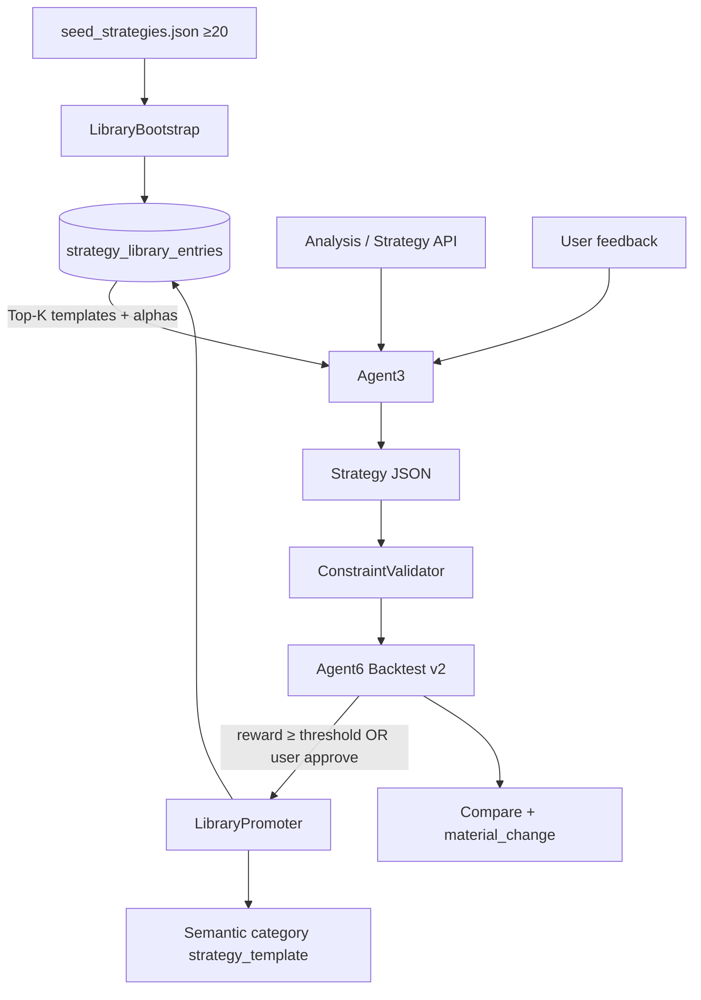

# 修改方案：回测可信度修复 + 策略库（≥20）+ Alpha 公式 + 以库为基生成与优质回灌

**日期:** 2026-07-27  
**依据:** `AgentTest1.md` 问题分析、`UserReq1.md` 人设、现有 `AnalysisStore` 空库  
**状态:** 已拍板并实施中  
**定稿默认:** JSON 种子 + Postgres（失败回退内存/JSON）；种子 24 条；`library_min_trades=3`，`library_min_reward=0.55`

---

## 0. 目标与成功标准

| 目标 | 成功标准 |
|------|----------|
| 修复 AgentTest1 暴露的结构性问题 | 单笔交易不再得到虚假高 reward；仓位变更能改变回测分数；请求标的不被静默丢弃 |
| 策略库冷启动非空 | ≥20 条可命名模板，每条含 **Alpha 公式 + 进出场/风控参数 + 适用 regime/标签** |
| 生成以库为基 | Agent3 `gather_context` / prompt 注入 Top-K 模板与 Alpha；输出可带 `library_entry_id` / `template_id` |
| 优质回灌 | 用户互动后回测达标 → 写入策略库（持久化）；可去重、可打分、可检索 |
| 库可运营 | `GET/POST/搜索` API；重启不丢；UI 能列出种子 + 学到的策略 |

---

## 1. 问题 → 对策映射（来自 AgentTest1）

| # | 问题 | 对策（本方案） |
|---|------|----------------|
| P0-1 | `size_pct` 不进盈亏 → feedback 改仓位分数不变 | `run_backtest` 按仓位加权收益；组合层算总回报/回撤 |
| P0-2 | n=1 → Sharpe=0、max_dd=0、reward≈0.467 | 最少交易数门槛；单笔路径用损失记入回撤；n 小时降权；默认走多窗口 walk-forward 再聚合 reward |
| P0-3 | Sharpe 爆炸（如 −15） | 样本不足返回 `sharpe=null` 或 Winsorize；reward 对无效 Sharpe 用中性项 |
| P1-1 | 忽略用户 ticker / 篮子 | 生成后 **硬校验**：请求标的必须出现或显式 `skipped_reason`；否则 repair |
| P1-2 | 仓位/暴露超限 | 可配置 `max_single_pct` / `max_gross_exposure`；超限自动缩放或拒收 |
| P1-3 | 几乎从不 short / 对冲弱 | 模板库提供 hedge/pair/mean-reversion 类；prompt 要求匹配意图 |
| P2 | Feedback 无实质变更仍 compare 过关 | compare 增加 `material_change`（仓位/动作/标的/风控是否变）；无变更则标记 |
| P3-1 | Regime 过度 sideways | 放宽/重标定 ADX·动量分支；证据写入 snapshot |
| P3-2 | 端到端 ~2.7min | 本阶段不强制流式；可选：解释异步、缓存行情 |
| L0 | 策略库空且不参与生成 | 种子 ≥20 + 持久化 + Agent3 检索注入 + 回灌 |

---

## 2. 持久化定稿

**采用：JSON 种子 + Postgres 运行时库（不可用时回退内存并落盘 `learned.json`）。**

- **种子:** `data/strategy_library/seed_strategies.json`（24 条，含 Alpha）启动时 upsert  
- **运行时:** 表 `strategy_library_entries`（与 episodic 同库）  
- **检索:** 按 reward/tags/regime；promote 时写入 semantic `strategy_template`

---

## 3. 目标架构



**生成原则:** AI **先选模板 / 组合 Alpha**，再按当前行情参数化（标的、size、stop），而不是从零幻觉仓位。  
**回灌原则:** 仅当回测可信（`n_trades≥N`、非 partial、reward 过线）或用户明确 approve 时入库；记录 `origin=learned|promoted|seed`。

---

## 4. 数据模型

### 4.1 Alpha 公式（声明式，先不做完整表达式引擎）

```text
AlphaFormula:
  formula_id: str
  name: str
  expression: str          # 人读 + LLM 用，如 "(close > sma_20) and (roc_20 > 0) and (rsi_14 < 70)"
  inputs: list[str]        # ["close","sma_20","roc_20","rsi_14"]
  direction: long|short|flat
  lookback_hint_days: int
  notes: str
```

运行时：`tools/alpha_eval.py` 用当前 `TechnicalIndicators` + last close **布尔求值**（安全白名单算子：比较、and/or/not、+/-/*、字段名）。  
不在本阶段实现任意 Python `eval`。

### 4.2 策略模板（库条目）

扩展 `StrategyLibraryEntry`：

| 字段 | 说明 |
|------|------|
| `template_id` | 稳定 ID，如 `tpl_sma_momentum_long` |
| `name` / `description` | 展示名 |
| `alphas` | `list[AlphaFormula]`（可 1–3 个） |
| `skeleton` | 仓位骨架（默认 size/stop/tp/horizon/action 规则） |
| `applicable_regimes` | `[sideways, bull, ...]` |
| `tags` | `[momentum, ma, etf, hedge, ...]` |
| `origin` | `seed` \| `baseline` \| `post_feedback` \| `promoted` |
| `quality_score` | 综合分（初始种子用先验；学到的用 reward） |
| `backtest_reward` / `backtest_metrics` | 最近一次或滚动均值 |
| `use_count` / `promote_count` | 运营统计 |
| `user_id` | `*` 表示全局种子；用户学到的用真实 user_id |
| `parent_template_id` | 从哪种子演化而来 |

### 4.3 Postgres

表 `strategy_library_entries`：JSON 列存 `strategy`/`alphas`/`metrics`；索引 `(user_id, quality_score desc)`、`tags` GIN（若可用）或简单 text。

---

## 5. ≥20 条种子策略 + Alpha（写入 `seed_strategies.json`）

> 风格对齐现有指标：SMA/EMA、RSI、MACD、ROC、ADX、布林、VIX/regime。  
> `expression` 供评估器与 LLM；实盘参数由 Agent3 按标的填充。

| # | template_id | 名称 | 适用 | Alpha expression（示意） | 骨架要点 |
|---|-------------|------|------|--------------------------|----------|
| 1 | `tpl_sma20_trend_long` | SMA20 趋势多 | bull/sideways | `(close > sma_20) and (sma_20 > sma_50)` | long 8–12%，stop 4%，h 10–20d |
| 2 | `tpl_sma200_regime_long` | 站上 SMA200 偏多 | bull | `(close > sma_200) and (sma_50 > sma_200)` | ETF/指数优先，stop 5% |
| 3 | `tpl_sma_death_de_risk` | 跌破均线降仓 | bear/uncertain | `(close < sma_50) or (close < sma_200)` | 减仓/改持 SPY 低仓，禁加杠杆 |
| 4 | `tpl_momentum_roc20_long` | ROC20 动量多 | bull/sideways | `(momentum_roc_20 > 0) and (close > sma_20)` | long，stop 5%，避开 RSI>75 |
| 5 | `tpl_momentum_roc20_fade` | 动量衰竭减仓 | volatile | `(momentum_roc_10 < 0) and (momentum_roc_20 > 5)` | reduce/flat 高飞个股 |
| 6 | `tpl_rsi_oversold_bounce` | RSI 超卖反弹 | sideways/bear | `(rsi_14 < 35) and (close > sma_200)` | 小仓试多，stop 4%，tp 6% |
| 7 | `tpl_rsi_overbought_trim` | RSI 超买减仓 | bull | `(rsi_14 > 70) and (macd.histogram < 0)` | reduce 或移至 ETF |
| 8 | `tpl_macd_hist_turn_long` | MACD 柱翻红 | sideways/bull | `(macd.histogram > 0) and (macd.macd > macd.signal)` | long 确认，stop 4% |
| 9 | `tpl_macd_hist_turn_exit` | MACD 柱翻绿离场 | any | `(macd.histogram < 0) and (close < sma_20)` | close/reduce |
| 10 | `tpl_adx_trend_follow` | ADX 趋势跟随 | bull/bear | `(adx > 25) and (close > sma_20)` | 顺势，size 中等 |
| 11 | `tpl_adx_chop_mean_rev` | ADX 弱震荡均值回归 | sideways | `(adx < 20) and (rsi_14 < 40) and (close < sma_20)` | 轻仓做多回归，短 horizon |
| 12 | `tpl_bb_lower_reclaim` | 布林下轨收回 | sideways | `(close > bollinger.lower) and (rsi_14 < 45)` | long，紧止损 |
| 13 | `tpl_bb_upper_reject` | 布林上轨拒绝 | sideways/volatile | `(close < bollinger.upper) and (rsi_14 > 65) and (momentum_roc_10 < 0)` | trim/short-hedge via ETF |
| 14 | `tpl_dual_ma_pullback` | 双均线回踩 | bull | `(close > sma_50) and (close <= sma_20 * 1.01) and (rsi_14 < 55)` | 回踩买入 |
| 15 | `tpl_quality_tech_sleeve` | 质量科技袖套 | bull/sideways | `(close > sma_50) and (momentum_roc_20 > 0) and (adx > 18)` | AAPL/MSFT 类，单票 ≤12% |
| 16 | `tpl_semicap_rs_long` | 半导体相对强 | bull | `(momentum_roc_20 > 0) and (close > sma_20) and (adx > 20)` | NVDA/AVGO/AMD 二选一，合计 ≤12% |
| 17 | `tpl_etf_core_spy_qqq` | 核心 ETF 杠铃 | any | `(spy_rule: close > sma_200) or (defensive: true)` | SPY/QQQ 核心 50–70% 思路（生成时拆仓） |
| 18 | `tpl_defensive_xlv_jnj` | 防御医疗压舱 | uncertain/bear | `(close > sma_50) and (rsi_14 < 60)` | XLV/JNJ，低波动 |
| 19 | `tpl_vol_de_risk_vix` | 高波动降风险 | volatile | `(vix > 25)` | 降 QQQ、加 XLV/现金代理，gross↓ |
| 20 | `tpl_pair_long_weak_short_strong` | 相对强弱配对 | sideways | `(roc_a > roc_b) and (adx < 25)` | long 相对强 / 轻空或低配相对弱（偏好 ETF 对冲） |
| 21 | `tpl_earnings_caution_small` | 财报季谨慎 | any+event | `(true)` + tag `event_risk` | size≤8%，stop≤4%，或改 QQQ |
| 22 | `tpl_crypto_satellite_tiny` | 加密卫星仓 | uncertain | `(momentum_roc_20 > 0)` on BTC-USD | **硬顶 3%**，主仓仍权益 |
| 23 | `tpl_post_correction_rsi_sma` | 回调后修复 | bear→sideways | `(rsi_14 < 40) and (close > sma_20)` | QQQ/SPY 反弹 |
| 24 | `tpl_gross_exposure_cap` | 组合暴露帽 | any | 元策略：生成后强制 `sum(size)≤max_gross` | 不单独交易，作后处理模板 |

种子文件中每条还包含：`default_stop_pct`、`default_tp_pct`、`default_horizon_days`、`max_size_pct`、`forbidden_actions`（如禁止裸空 mega-cap）、`rationale_template`。

**最少交付 20 条；上表 24 条可一并入库（含 1 条元策略）。**

---

## 6. 模块改动清单

### 6.1 回测可信度（P0）— `tools/backtest_tools.py` + `agents/agent6_backtest.py`

1. **仓位加权:** `position_return_weighted = net_return * (size_pct/100)`；`total_return = sum(weighted)`（并可选归一化到 gross）  
2. **盯市回撤:** 按交易日合并多仓权益曲线再算 max_dd（至少：单笔亏损记 `|min(0,r)|` 为 dd 下界）  
3. **样本门槛:** `min_trades_for_sharpe`（默认 5）；不足则 `sharpe_ratio=None`，reward 中 Sharpe 项用 0.5 中性  
4. **默认评估:** `evaluate_strategy` 改为 walk-forward 多窗平均 reward（保留单窗 API）  
5. **partial_data:** 缺行情标的降权或拒绝 promote  

### 6.2 约束校验（P1）— 新 `tools/strategy_constraints.py`

- 输入：用户 query 解析出的 tickers、settings 风险上限、策略 JSON  
- 输出：`ok | repaired_strategy | violations[]`  
- 规则：必含 ticker（或白名单替换）、单票/总暴露、加密上限、裸空 mega 警告  

接入：`AnalysisFlow` / `Agent3.generate_*` 返回前。

### 6.3 策略库（L0）

| 文件 | 改动 |
|------|------|
| `schemas/strategy_library.py` / 新 `schemas/alpha_formula.py` | 扩展模型 |
| `data/strategy_library/seed_strategies.json` | ≥20 种子 |
| `memory/strategy_library_store.py` | Postgres CRUD + 种子 bootstrap |
| `memory/analysis_store.py` | 委托新 store 或废弃内存 list |
| `tools/alpha_eval.py` | 安全表达式求值 |
| `orchestrator/pipeline.py` | bootstrap on init；promote API |
| `agents/agent3_strategy.py` | context 注入 Top-K；prompt 强制“基于模板/Alpha” |
| `orchestrator/analysis_flow.py` | 回测后 `maybe_promote`；feedback 后同理 |
| `api/server.py` | `GET` 增强过滤；`POST /library/strategies`；`POST .../promote` |
| `api/static/index.html` | 列表展示 name/tags/reward/alpha |
| `config/settings.py` | `library_min_reward`、`library_min_trades`、`max_single_pct` 等 |
| `tests/test_strategy_library.py` 等 | 种子加载、加权回测、promote、约束 |

### 6.4 以库为基的生成流程

1. `retrieve_candidates(regime, tags, query_tickers, user_id, k=5)`  
2. 对候选 Alpha 用当前指标 `alpha_eval` → `signal_hit: bool`  
3. Prompt 段落：`## Strategy Library Candidates`（模板摘要 + 命中 Alpha + 历史 quality）  
4. Agent3 必须输出 `metadata.template_id` / `metadata.alphas_used`  
5. 校验器检查与模板/用户意图一致性  

### 6.5 回灌规则（Promote）

写入库当且仅当：

```text
(not partial_data)
AND (total_trades >= library_min_trades)          # 建议 3
AND (terminal_reward >= library_min_reward)       # 建议 0.55，可配
AND (material strategy OR user overall_verdict in {agree, partial} after feedback)
OR (user explicitly approved strategy)
```

- 与已有 `template_id` 相似则 **更新 quality 滑动平均**，而非无限追加  
- `origin=promoted`，`parent_template_id` 保留  
- 同步一条 semantic fact：`category=strategy_template`  

### 6.6 Compare 增强

- `material_change`: 标的集合、动作、size（>1pp）、stop、horizon 任一变化  
- 若仅文案变化：`comparison_narrative` 注明 “no material change；metrics identical expected”  

---

## 7. API 契约（增量）

| Method | Path | 说明 |
|--------|------|------|
| GET | `/library/strategies?user_id=&tag=&min_reward=&limit=` | 含全局 seed（`user_id=*`） |
| GET | `/library/strategies/{entry_id}` | 单条 |
| POST | `/library/strategies` | 手动/管理写入（可选鉴权） |
| POST | `/library/strategies/promote` | body: `strategy_id` / `analysis_id` + 可选 force |
| GET | `/library/strategies/search?q=` | 名称/标签/公式文本 |

现有 Analysis 流程自动 promote，无需用户每次手动。

---

## 8. 实施分期

### Phase 1 — 可信回测 + 约束（约 1–2 天）
- 加权 PnL、回撤修正、Sharpe/reward 门槛、约束校验  
- 单测 + 用 3 条 AgentTest1 类请求回归  

### Phase 2 — 种子库 + 持久化 + 生成注入（约 2–3 天）
- 模型、JSON≥20、bootstrap、Agent3 Top-K、API 列表  

### Phase 3 — 回灌 + compare/UI（约 1–2 天）
- promote 规则、semantic 同步、UI、端到端：空库→种子→生成引用模板→优质回写  

### Phase 4（可选）
- Regime 重标定、异步解释降延迟、Alpha DSL 扩展  

---

## 9. 测试计划

| 测试 | 断言 |
|------|------|
| 加权回测 | 同方向两笔，size 翻倍 → `|total_return|` 近似翻倍 |
| 退化 reward | n=1 亏损 → reward **≠** 固定 0.467（或显式 `low_sample=true` 且不 promote） |
| 种子加载 | 启动后 `list_library` ≥20 |
| 生成引用 | 输出 `metadata.template_id` 属于种子集合 |
| 约束 | 请求 `["JNJ","MSFT"]` 不得只返回无关单票且无 skipped |
| 回灌 | 高 reward 双窗回测 → 库 count+1；低样本不入库 |
| 回归 | `pytest` agent2/3/6 + analysis_flow；抽 5 条 UserReq 再跑 |

---

## 10. 风险与非目标

- **非目标（本方案不做）:** 完整 WorldQuant 表达式编译、实盘下单、多租户权限细粒度  
- **风险:** LLM 仍可能忽略模板 → 用校验器兜底；Postgres 不可用时回退 JSON（需明确开关）  
- **种子 Alpha** 是规则先验，不保证历史超额；quality 以真实回测回灌为准  

---

## 11. 已拍板决策

1. 持久化：**JSON 种子 + Postgres**（回退内存/JSON）  
2. 回灌：`library_min_reward=0.55`，`library_min_trades=3`  
3. 种子：**24 条全做**

---

## 12. 文档与代码落点预览

```
docs/superpowers/specs/2026-07-27-strategy-library-alpha-design.md  ← 本方案可复制为正式 spec
data/strategy_library/seed_strategies.json
schemas/alpha_formula.py
memory/strategy_library_store.py
tools/alpha_eval.py
tools/strategy_constraints.py
tools/backtest_tools.py          # P0
agents/agent3_strategy.py
orchestrator/analysis_flow.py
api/server.py
```
